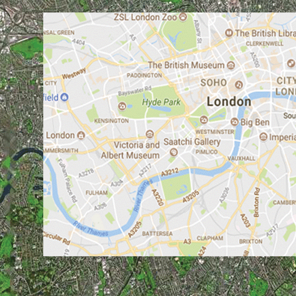

# Introduction to Software Architecture Design

### Getting Started

Clone this repo: `git clone https://github.com/MohammadAlhalaq/Workshop-Software-Architecture-Design.git`

### Learning Outcomes
- To understand the general importance of software architecture design.
- To start developing the critical ability to identify distinct elements of your app and their relations.
- To apply this knowledge, and learn how you might begin architecting an app pre-build.

### Group Introduction To Topic

Presentation on The Importance of Software Architecture -- see [pages 3-7](https://drive.google.com/open?id=1PYrwuaMmbudzECW0q6H9bBjvjW-Nsqm3) as a group.

### What Is Software Architecture Design?

- ##### Architecture is a *general* term for the overall structure of a software system. Fundamentally, it's about managing complexity.

It is like showing a route on a map. Both the route and the map are abstractions of a more complicated reality, allowing us to find our way and conceptualise the landscape.

- ##### Software architecture shows how all the parts of an app might interact with each other.

- ##### Architectural concerns also affect our file structure and _how we write code_ in a macro way. We will cover architecture-friendly code in a later workshop.

### Exercise 1: Read the steps below. We will map out an API call on the board taking into account the relationship between the [client](https://techterms.com/definition/client) and [server](https://techterms.com/definition/server).

The diagram below represents a complex reality (an API call) in an abstract way. That's a kind of architecture. It's the **client-server model**.

- Our user interacts with the graphic interface, e.g. they click a button with an event listener attached to it.
- This triggers an instance of an API call.
- The API call sends a request to the database server, which returns a response.
- The response is a big object which needs to be filtered through.
- The desired results are sent to the DOM, updating the display.
- The user interacts with the updated graphic interface, etc.

## We Just Whiteboard-ed Some Software Architecture

##### Why should you whiteboard your architecture?

- If you cannot whiteboard the architecture then it suggests that it is not well understood.
- If you can provide a clear and concise whiteboard diagram, others will understand it and you can communicate details to them more easily.

## Why is Architecture Important?

Good architecture is fundamental. It makes your system easier to maintain, test, extend, scale up (or down), and reason about. It makes it more *reliable*.

To use an analogy...

Scenario 1. You're in a rush to leave home and you can't find your keys. Your room is super messy and your keys could be in 1 of 57 places. You are late and miss the first part of your morning challenge at F&C. Doh!

Scenario 2. All of your belongings are arranged according to categories. There's only one place your keys could be. Life is a breeze.

Conclusion is, Messy systems are costly and they cause frustrating delays.

Clean and ordered systems mitigate complexity and make your life easier in the long run.  

>"The quality and longevity of a software system is determined by its architecture" -- Linda Northrop in ["The Importance of Software Architecture"](https://drive.google.com/open?id=1PYrwuaMmbudzECW0q6H9bBjvjW-Nsqm3), Carnegie Mellon University.

## Types of Software Architecture

There are many different approaches to architecting software, depending on the situation.

For a comprehensive overview of different Architectural Styles and Patterns that people have developed, have a look at [this guide](https://msdn.microsoft.com/en-us/library/ee658117.aspx). But don't get overwhelmed; every application/product you work on will require a unique approach to architecture that you will learn on the go. Similarly, every organisation has its own in-house way of doing things.  

## Key Principles To Keep in Mind :key:

We're going to start designing the architecture for our own app in a bit.

When you are architecting an app, try to keep these **key principles** in mind:

- How can you **separate your concerns**? i.e. keep unrelated things in separate sections
- Which aspects of your app are **generic**, and which are **specific** to your requirements?
- How can you make it **easy to test**?
- How can you make it **easy to change**?
- Can you **anticipate changes** that are likely to occur?

>"If you don't develop an architecture, you will get one anyway - and you might not like what you get!"
>-- Northrop, [The Importance of Software Architecture](https://drive.google.com/open?id=1PYrwuaMmbudzECW0q6H9bBjvjW-Nsqm3)

## Exercise 2: Restructuring A File System

Your file structure is an architectural structure in its own right. Again, it is an _attempt to manage complexity_.

Keeping the Key Principles above in mind, how would you reorganise the files of this repository? (They are intentionally empty files, by the way.)

_**Tip**: if you haven't done so already, you can run `npm install file-icons` so that all your atom icons have icons displaying in the file tree, making them easier to distinguish_

If you finish early, [here](https://msdn.microsoft.com/en-us/library/ee658124.aspx#KeyDesignPrinciples) are some more detailed Key Principles.

## Exercise 3: Clean up your files

Now's the perfect time to go back to your past projects on GitHub and neaten up the file structure.

##### Remember:

- There is no right way to show your architecture in a diagram. You need to decide as a group which approach(es) you will adopt, as long as you can justify your choice.
- You can think of it as drawing out a flow diagram, showing how all parts of the app interact with each other.
- The most important thing is to simplify without leaving out crucial processes.
- Avoid writing code at this point. You _can_ talk about it in terms of pseudo-code if this helps.

## Summary

- Architecture is a conceptual representation of how an app is structured and how all the parts of it interact
- Good architecture mitigates complexity, so that code is easier to maintain, scale, test, and reason about
- There are many different ways of representing architecture. It requires both organisation and vision.
